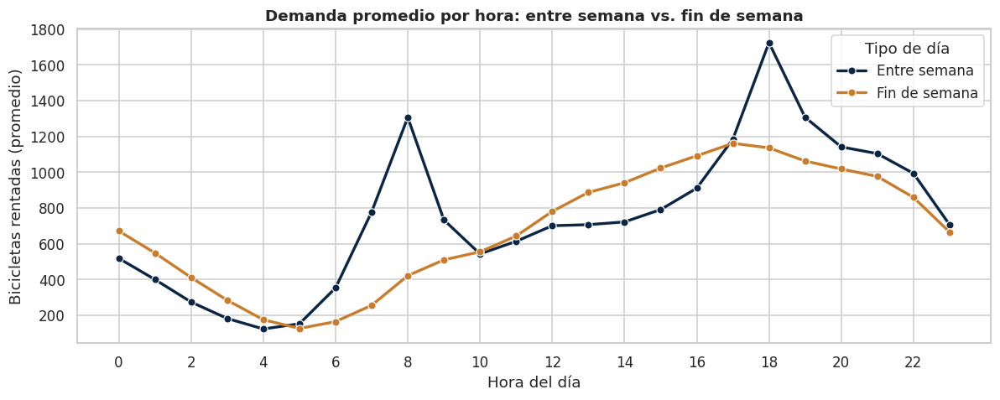
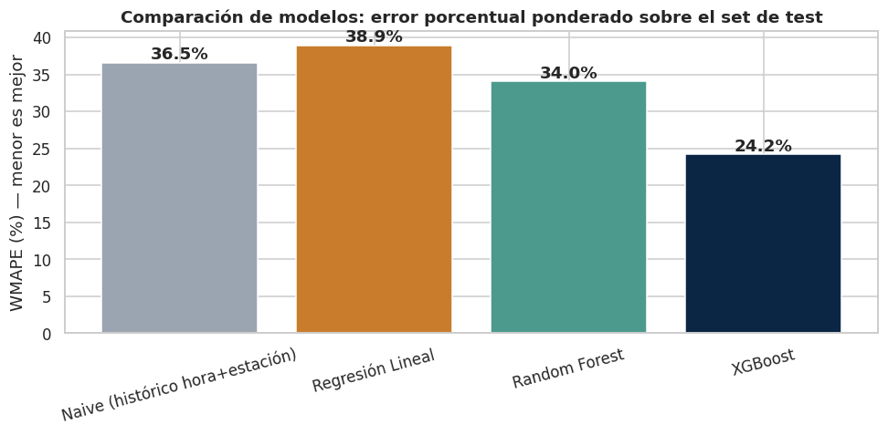

# 🚲 Seoul Bike Sharing Demand — Forecasting & Operational Insights

Predicción de demanda horaria de bicicletas compartidas en Seúl, con foco en **decisiones operativas de rebalanceo de flota**, no solo en maximizar una métrica de error.

**Dataset:** [UCI Machine Learning Repository — Seoul Bike Sharing Demand](https://archive.ics.uci.edu/dataset/560/seoul+bike+sharing+demand) (Sathishkumar V E, Park & Cho, 2020) · Licencia [CC BY 4.0](https://creativecommons.org/licenses/by/4.0/)
**Autor:** Martin Delgado Huayhua — Senior Data Scientist

---

## 🎯 Problema de negocio

Una operadora de bike-sharing necesita saber **cuántas bicicletas posicionar, y cuándo**, para minimizar dos costos simétricos: sobre-oferta (bicicletas inmovilizadas sin uso) y sub-oferta (usuarios sin bicicleta disponible en hora pico). Este proyecto construye un modelo de forecasting horario y lo traduce en recomendaciones operativas concretas — no se queda en el R².

## 📊 Resumen de resultados

| Modelo | RMSE | MAE | R² | WMAPE |
|---|---:|---:|---:|---:|
| Naive (histórico hora + estación) | 452.2 | 308.5 | 0.34 | 36.5% |
| Regresión Lineal | 462.5 | 328.3 | 0.31 | 38.9% |
| Random Forest | 402.7 | 287.5 | 0.48 | 34.0% |
| **XGBoost** | **281.8** | **204.1** | **0.74** | **24.2%** |

*Evaluado sobre un split **cronológico** (últimos 60 días como test), no aleatorio — ver justificación en el notebook.*

**El hallazgo más importante de la tabla no es "XGBoost ganó"**: es que la **regresión lineal no logra superar un baseline ingenuo** (promedio histórico por hora+estación). Eso confirma que la relación entre clima/tiempo y demanda es no lineal, y es la evidencia que justifica (o no) llevar complejidad de ML a producción.

## 🔑 Insights clave

1. **El invierno no es "más bajo", es un régimen de demanda distinto**: -78% vs. verano (225 vs. 1,034 bicicletas/hora en promedio). No es una pendiente suave — es un colapso concentrado.
2. **Patrón bimodal entre semana (commute) vs. unimodal el fin de semana (recreativo)**. Pico absoluto del año: 18:00 h en día hábil (~1,730 bicicletas/hora).
3. **Lluvia y nieve reducen la demanda en ~75-78%** cuando ocurren (aunque son solo ~5-6% de las horas del año) — alto impacto puntual, bajo impacto promedio.
4. **`Temperature` y `DewPointTemp` correlacionan en 0.91** → se elimina `DewPointTemp` del modelo por multicolinealidad.
5. **`FunctioningDay = No` implica `RentedBikeCount = 0` en el 100% de los casos** (295 horas) — se excluyen del modelamiento por ser cierre operativo, no señal real de demanda (evitar leakage).
6. **El modelo falla más justo en las horas pico de commute** (7-9am, 17-20h) — es la prioridad de la siguiente iteración, no un detalle a esconder por tener buen R² global.

<p align="center">
  
</p>

<p align="center">
  
</p>

## 💡 Recomendaciones operativas

- Diseñar **dos políticas de rebalanceo de flota** (entre semana vs. fin de semana), no una curva horaria única.
- Incorporar **pronóstico meteorológico de corto plazo** (2-3h) como input operativo adicional, dado el impacto desproporcionado de lluvia/nieve.
- Tratar el **cambio a temporada de invierno como un evento de replanificación de flota**, no como tendencia gradual.
- Priorizar reducción de error en **ventanas de commute**, donde el costo de negocio de un error es más alto.

## 🗂️ Estructura del proyecto

```
seoul-bike-demand-forecast/
├── README.md
├── requirements.txt
├── data/
│   └── raw/SeoulBikeData.csv          # dataset original (UCI, CC BY 4.0)
├── notebooks/
│   └── 01_bike_demand_analysis.ipynb  # análisis end-to-end, ejecutable en Jupyter
└── reports/
    ├── figures/                       # gráficos generados por el notebook
    ├── model_results.csv
    └── feature_importance.csv
```

## ▶️ Cómo correrlo

```bash
git clone <este-repo>
cd seoul-bike-demand-forecast
python -m venv venv && source venv/bin/activate      # o el gestor de entornos que prefieras
pip install -r requirements.txt
jupyter notebook notebooks/01_bike_demand_analysis.ipynb
```

El notebook es autocontenido: corre de principio a fin sin pasos manuales adicionales, y regenera todas las figuras en `reports/figures/`.

## 🔬 Metodología (resumen técnico)

- **Calidad de datos:** detección de leakage vía `FunctioningDay` (excluido del modelamiento).
- **Target:** `log1p` transform para estabilizar varianza; evaluación en escala real (bicicletas/hora).
- **Feature engineering:** encoding cíclico (seno/coseno) para hora y mes; flags de fin de semana y feriado; one-hot de estación; eliminación de `DewPointTemp` por multicolinealidad (r=0.91 con `Temperature`).
- **Validación:** split **cronológico** (no aleatorio) — últimos 60 días como test, simulando forecast real hacia el futuro.
- **Modelos comparados:** baseline histórico (hora + fin de semana + estación), Regresión Lineal, Random Forest, XGBoost.
- **Métricas:** RMSE, MAE, R², WMAPE (preferida sobre MAPE simple por la alta variabilidad de conteos bajos en horas de madrugada).

## ⚠️ Limitaciones y próximos pasos

- Un solo año de datos (dic-2017 a nov-2018): no valida repetibilidad interanual del patrón estacional.
- Dataset agregado a nivel ciudad, sin granularidad por estación física.
- Feature importance basada en *gain* puede sobre-ponderar splits tempranos (`Season_Winter`); el siguiente paso natural es *permutation importance* o SHAP.
- Para dimensionamiento de flota real, un intervalo de predicción (*quantile regression*) es más útil que un punto estimado único.

## 📖 Cita del dataset

> Sathishkumar V E, Jangwoo Park, and Yongyun Cho. "Using data mining techniques for bike sharing demand prediction in metropolitan city." *Computer Communications*, Vol.153, pp.353-366, March 2020.
> Seoul Bike Sharing Demand [Dataset]. (2020). UCI Machine Learning Repository. https://doi.org/10.24432/C5F62R
